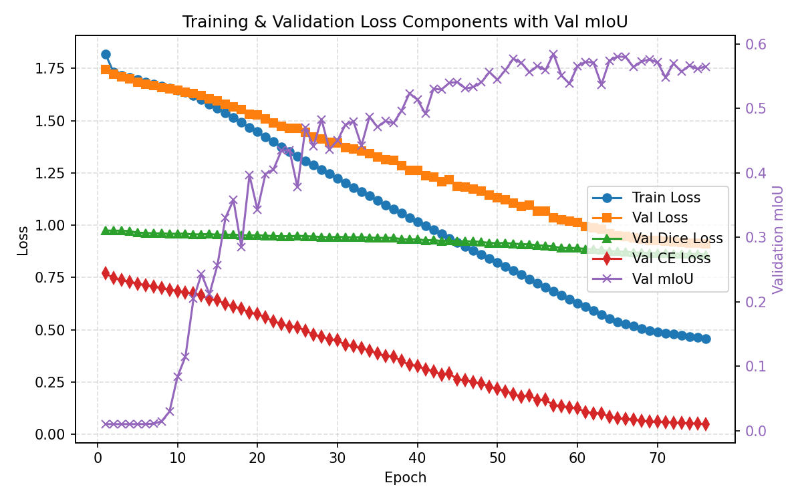
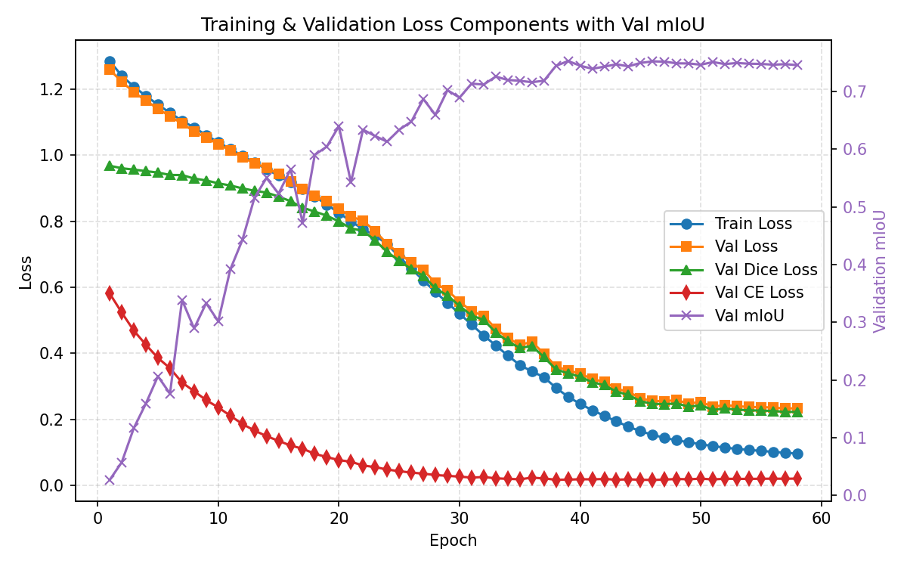
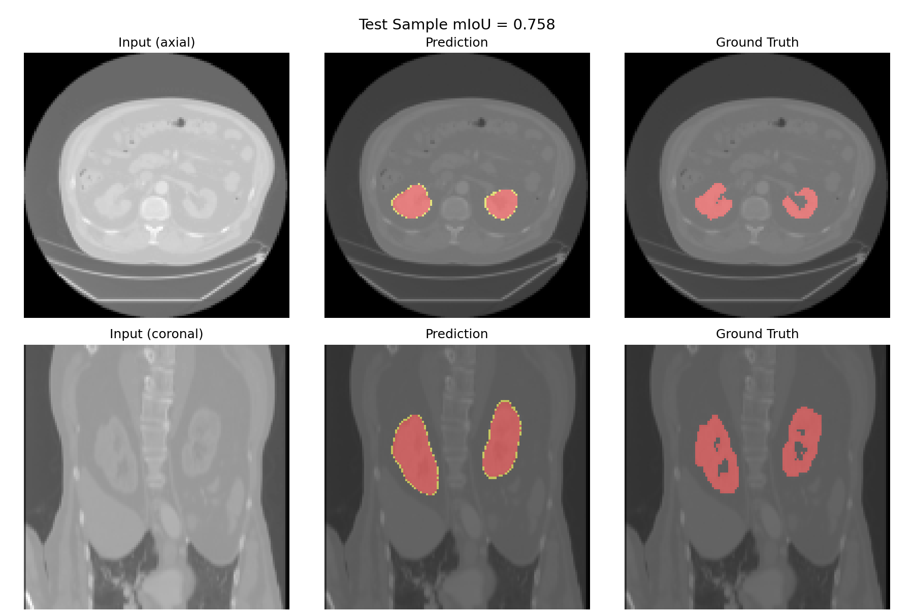
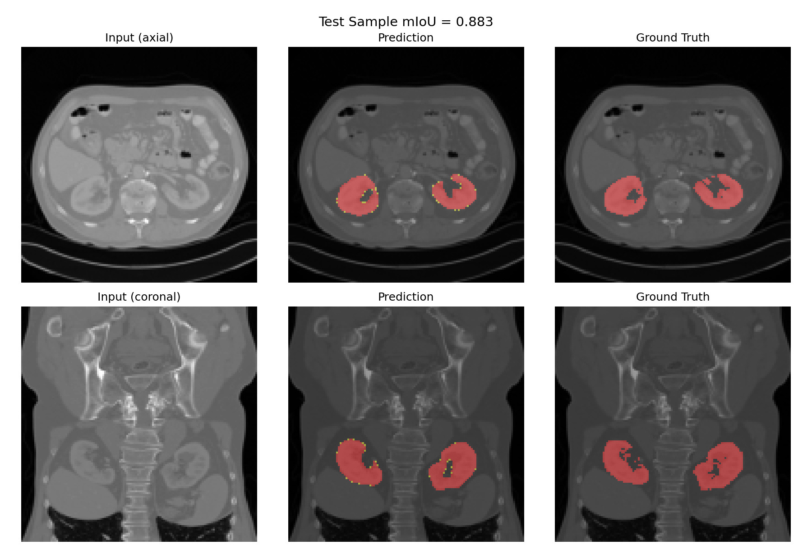

# Tune PyTorch

How to tune the learning hyper parameters for PyTorch UNet-based segmentation with two examples:
* 3D segmentation of the kidneys on CT: [pytorch3d_segmentation_learn.py](../tools/neural_net/torch_segmentation/torch3d_segmentation_learn.py).
* 2D segmentation of the trachea on chest x-ray: [pytorch2d_segmentation_learn.py](../tools/neural_net/torch_segmentation/torch2d_segmentation_learn.py).

The 2D and 3D learning scripts have differences in CNN models and hyper parameters available.
* The scripts provide documentation of all hyper parameters.

***

## 1. Baseline Setup

### Model Selection

The 3D learner provides a UNet architecture: 
* default is `channels`=[16, 32, 64, 128, 256], which specifies the number of feature maps in each encoder/decoder level
* `strides`=[2, 2, 2, 2]

For a 128×128×128 input, this will downsample four times:
1. Level 0 (encoder entry): 1→16 channels, spatial 128³
2. Downsample by 2 → 64³, channels 32
3. Downsample by 2 → 32³, channels 64
4. Downsample by 2 → 16³, channels 128
5. Downsample by 2 → 8³, channels 256 (bottleneck)

The decoder then upsamples symmetrically back to 128³ using those feature depths. So channels controls the depth (number of filters) at each resolution, while the strides control how many times you halve the spatial size.

This generally works well for kidney-sized structures. If the kidneys cover only a few slices or you’re struggling with memory or overfitting, you could experiment with:
* Reducing depth (e.g., `channels`=[16, 32, 64, 128] and `strides`=[2, 2, 2]), so the bottleneck is 16³ instead of 8³.
* Adding depth (higher channel counts) if you have ample GPU memory and are experiencing underfitting.
* But unless you have evidence that the model underfits or overfits, the default architecture is a solid baseline for 128³ inputs. 
* Tuning the loss or augmentation often yields bigger gains than tinkering with the UNet depth. 

The 2D learner provides Unet model choices via the `model_backbone` parameter. 
* For the trachea example we used efficientnet_b0 and also experimented with resnet50 and mobilenetv3_small_100.
* These are lightweight models (relatively few parmeters) given the simplicity of the problem.

The 2D learner supports pretrained encoder weights (the 3D learner currently does not). For the tracheaa we used `pretrained`=true.
* This initializes the backbone encoder with weights trained on ImageNet-1k — a large, generic dataset of 1.2 million natural images across 1,000 classes.
* Its convolutional (or transformer) layers have learned to extract general-purpose (foundational) visual features: edges, corners, textures, gradients, object parts, etc.
* The decoder is usually initialized randomly, it’s task-specific and learns to map the encoder’s feature maps to a segmentation mask, thereby fine tuning the model for our specific problem.

Details of the Unet architecture are written to the output folder in `log_model.txt`.

### Data Split

The train/validation/test split is set at 60/20/20 by default.

For smaller cohorts (e.g., < 100 cases), consider `split_ratio = [70,15,15]` or even `[80,10,10]`.
* This can leave a very small number of validation cases which may be noisy during optimization.

### Optimizer

Adam only is used in the the 3D learner, 2D allows selection of Adam or AdamW.
* For 3D medical segmentation tasks, Adam is usually the better default: it’s simpler, converges quickly, and with moderate weight_decay, it handles the small batch size well. 
* AdamW (Adam with decoupled weight decay) can help if you crank up weight decay for regularization, but it seldom yields big gains on 128³ UNets. 
* AdamW is used in our trachea example.

### Loss Function

The loss is a measure of error between the neural network output and the reference (training set). 
* It is a cost function for optimization of neural network weights.
* The choice of loss function is crucial to the success of machine learning.
* It must quantify whether the output is a good match to the reference and provide good gradients for convergence.

**Loss criterion: weighted Dice + binary cross-entropy loss**
* `DiceBCELoss = loss_dice_weight*DiceLoss + loss_ce_weight*BCEWithLogitsLoss`
* BCEWithLogitsLoss: Per-pixel probability accuracy - good for well-balanced classes (target and background)
    - Logits are the raw, unnormalized outputs of a neural network before they’re passed through a squashing function like sigmoid or softmax. 
    - The loss functions (cross entropy, DiceCELoss) expect logits so they can combine the sigmoid or softmax internally with the log-likelihood computation. 
    - Logits represent how strongly the model leans toward class 1 versus class 0 before probabilities are computed.
* DiceLoss (1 - Dice): Mask overlap (F1/Dice coefficient) - better for imbalanced or small structures
* Dice + BCE (combined): Balances pixel-accuracy and region overlap - best general-purpose choice
    - combined loss function has a range 0.0 - 2.0 with lower being better

In terms of training convergence:
* DiceLoss drives shape overlap improvement (macro-level).
* BCEWithLogitsLoss gives stable gradients early in training (micro-level).
* Together they converge faster and generalize better, especially with small data.

Tunable loss parameters:
* `loss_dice_weight` and `loss_ce_weight`: weights are in the range 0.0 - 1.0 to control the balance between Dice and BCE when computing the loss
    - Start with `loss_dice_weight=1.0`, `loss_ce_weight=1.0`.
    - If you see the model chasing CE at the expense of overlap, try rebalancing (e.g., `loss_dice_weight=1.0`, `loss_ce_weight=0.5`).
* `label_smoothing` and `label_smooth_edge_width`: soften the ground-truth targets near mask boundaries - handy when the foreground is small (available for 2D learner only).
    - For the trachea, we used 	`label_smoothing`=0.2, `label_smooth_edge_width`=3.0.

### Batch Size

Start with `batch_size` in the range 2 - 16.
* This will be limited by the available GPU memory.
    - `log_training.txt` provides usage information for each epoch.
* For the 3D kidney, we initialized to 2.
* For the 2D trachea, we initialized to 16.

### Learning Rate and Patience

Start with: 
* `learning_rate = 1e-4`
* `weight_decay = 1e-4`
* `lr_factor = 0.5`: reduce LR by this fraction after a number of stagnant epochs (specified by patience)
    - it halves the learning rate each time validation performance stalls
    - You can adjust it later if you find the LR dropping too quickly (use 0.7–0.8) or if you need more aggressive decay (0.2–0.3).
* `lr_patience = 5`: reduce LR by factor after this number of stagnant epochs

### Epochs

Initially set: 
* `num_epochs = 200`: maximum number of epochs
    - This is often set at 100, but we can go to 200 because it will often stop early due to the patience setting.
    - Increase if loss is still decreasing.
* `early_stop_patience = 20`: stop after this number of epochs with no improvement

### Example - Kidney 3D

Validation mIoU: 0.5586, Test mIoU = 0.5242
* `loss_miou_curve.png` shows that the validation loss is dominated by the CE loss, while the Dice stays constant
* Dice is important for segmentation, to address this we will change the DCE/CE weighting in the loss function

**After changing DCE/CE &rarr; 1.0/0.5: Validation mIoU: 0.7463, Test mIoU = 0.6905**
* Both Dice and CE loss improve
* mIoU performance improves
* This is our baseline model setting

Median DCE test case:

***

## 2. Learning Rate Tuning

Try a few different learning rates: `learning_rate` = [1e-5, 5e-5, 1e-4, 3e-4, 5e-4, 1e-3]
* Compare validation and test loss against baseline performance. 
* Then fix it and continue tuning other hyper parameters.

### Example - Kidney 3D

| Learning Rate | Validation mIoU | Test mIoU |
| --- | --- | --- |
| 1e-5 | 0.2326 | 0.2358 |
| 5e-5 | 0.2726 | 0.2890 |
| 1e-4 | 0.7463 | 0.6905 |
| 3e-4 | 0.7777 | 0.7093 |
| **5e-4** | **0.8061** | **0.7623** |
| 1e-3 | 0.0816 | 0.7339 |

Best Learing Rate = 5e-4.

***

## 3. Tune Optimizer & Weight Decay

weight_decay 
* It penalizes large weights every step, effectively adding a shrinkage term to the gradients. 
* This combats overfitting by nudging weights toward zero (see [How to Recognize Overfitting](#7-how-to-recognize-overfitting))
* If validation loss diverges while training loss improves → increase weight_decay (1e-3).
* If both stagnate → lower weight_decay (1e-5).
    - weakens regularization, so the model may fit training a bit faster but also usually generalizes slightly worse

Adam or AdamW
* Adam: applies weight decay as part of gradient (L2 regularization)
* AdamW: weight decay applied separately from gradient

### Example - Kidney 3D

**After increasing `weight_decay` &rarr; 1e-3: Validation mIoU: 0.8096, Test mIoU = 0.7612**
* There was no overfitting on the validation loss, but test mIoU was lower than validation so tried increasing the decay: 1e-4 → 1e-3.
* Improved test mIoU slightly.

***

## 4. Encoder Unfreezing (2D learner only)

When using pretrained weights, experiment with the 2D learner’s `encoder_unfreeze_mode`:
* `"immediate"` (baseline): encoder + decoder train together from the start.
* `"frozen"`: keep the pretrained encoder fixed for the entire run
    - useful if data is scarce and the pretrained features already transfer well.
* `"gradual"`: start frozen and progressively unfreeze encoder stages at fixed epoch percentages (defaults 30%, 60%, 90%), beginning with the deepest layers. 
    - Fine-tune the highest-level features first.

***

## 5. Tune Batch Size

Vary batch size within the range 2 - 16 (multiple of 2) if training performance is not adequate:
* Large batches: fewer gradient updates per epoch mean smoother, more deterministic gradients (better throughput), can converge to sharper minima, but require more GPU memory.
    - If limited GPU memory, use gradient accumulation for a larger effective batch.
    - If `gradient_accumulation` = k, you process k mini-batches, sum their gradients (each scaled so the final sum matches the average), and only then call optimizer.step(). 
    - This makes it equivalent to training with a single batch that's k times larger.
    - When increasing the batch size, you may also need to increase the learning rate.
* Small batches: noisy gradient estimates that can act as regularization (sometimes better generalization), but training is noisier with more updates per epoch, require less memory.
    - Larger batch size is not always better.

### Examples

Kidney 3D:
* We initialized to the lowest possible batch size of 2.
* **Increasing batch size to 4: Validation mIoU: 0.8089, Test mIoU = 0.7626** 
    - There may be more overfitting (separation between training and validation loss), but test mIoU held consistent
    - Consider applying augmentation to both batch sizes (2 and 4)
* Increasing batch size to 8: Validation mIoU: 0.6141, Test mIoU = 0.5911
    - Worse performance, don't increase further.

2D training for trachea CXR:
* Reduced batch size from 16 to 8
* Slightly better test set performance (maybe slightly more generalizable model)

***

## 6. Regularization & Augmentation

Since generalizability is a challenge for small medical imaging training sets, you’ll often get more performance gain here than from optimizer tuning.
* These techniques reduce overfitting.
* See [How to Recognize Overfitting](#7-how-to-recognize-overfitting)

**Dropout**: During training (not inference), adds random neuron deactivation (zeros a fraction of activations). 
* It forces the network to rely on multiple redundant pathways, improving generalization.
* `dropout` defaults to 0, but experiment with 0.1 (range: 0.05 - 0.3)
* For the 2D learner, dropout is only inserted in the decoder blocks
    - this is appropriate since we are starting with a pretrained imagenet encoder
* For the 3D learner dropout is applied to both encoder and decoder stages (we are not using a pretrained encoder)

**Augmentation**: applies transformations to create varied versions of existing images during training and improve model robustness.
* To maintain flexibility, rather than only allowing preprocessing functions in pytorch, SM uses a hybrid approach between image preprocessing tools followed by augmentation within pytorch.
* Preprocessing (CLAHE, normalization, cropping, etc.) is performed in SM, before images are passed to the pytorch tool.
* For the json parameter details, see the documentation in [pytorch2d_segmentation_learn.py](../tools/neural_net/torch_segmentation/torch2d_segmentation_learn.py) and [pytorch3d_segmentation_learn.py](../tools/neural_net/torch_segmentation/torch3d_segmentation_learn.py).

For medical imaging, light runtime ("on-the-fly") augmentation is recommended:
* Random flips: horizontal and vertical
    - `aug_h_flip_prob`: 0.5  (flip left/right anatomy)
    - `aug_v_flip_prob`: 0.0 (don’t flip superior/infereior anatomy)
* Small rotations: ± 5°
    - `aug_degrees`: 5
* Small translations: ± 5%
    - `aug_translate`: [0.05, 0.05]
* Scaling: ± 5%
    - `aug_scale`: [0.95, 1.05]
* Elastic deformation: mild settings
    - `aug_persp_distortion_scale`: 0.03
    - `aug_persp_p`: 0.2
    - `aug_deformation_alpha`: 10
    - `aug_deformation_sigma`: 5
    - `aug_deformation_p`: 0.2

The input dataset still has the same number of samples, but every epoch, each image is randomly perturbed. 
* This discourages the model from memorizing pixel-level details. 
    - The model must learn features that are invariant to small transformations (rotation, lighting, contrast).
    - It effectively learns shape, structure, and context, not raw intensity correlations.
* It’s a form of regularization, not dataset expansion. 
    - The model never sees exactly the same image twice — but the dataset size stays the same.

Other options to combat overfitting:
* Smaller batch sizes (noisier gradients).
* Increase weight_decay.

### Examples

Dropout didn’t help for trachea, so we are not currently applying it, but we are applying smoothing of labels.

Careful when applying augmentations that aren't plausible.
* For the 2D trachea, 0.5 horizontal flipping helped, but for CXR trachea vertical flipping did not (perhaps since the body has bilateral symmetry).
* For the 3D kidney, vflipping did no harm, and may have improved test performance very slightly.

**Adding augmentation: Validation mIoU: 0.8656, Test mIoU = 0.8393** 

Median DCE test case:

***

## 7. How to Recognize Overfitting

The steps below will include recommendations in the case of "overfitting". We can recognize overfitting by reviewing the `log_training.txt` file.

General Rule of Thumb for segmentation:

| Test mIoU                             | Δ (val–train loss)                    | Interpretation                            |
| ------------------------------------- | ------------------------------------- | ----------------------------------------- |
| **> 0.90**                             | **-**                             | Normal, expected                          |
| **-**                             | **< 25%**                             | Normal, expected                          |
| **0.75 - 0.90**                             | **≥ 25%**                            | Mild-Moderate overfitting (common in segmentation) |
| **< 0.75**                             | **25 - 50%**                            | Mild-Moderate overfitting (common in segmentation) |
| **< 0.75**                             | **> 50%**                             | Significant overfitting                   |

***

## 8. Developer Notes: Training Data

Set up the training data for kidney CT segmentation. 
* Create a csv file for the training data using the documentation in [`upload_dataset.py`](../upload_dataset.py).
* Source data: `/radraid/apps/all/simplemind-applications/kidneys_abd_ct`.
* From a CVIB server connected to `radraid`, I downloaded the data to my PC via vscode and then copied it to the `data` folder on `gpu-1` using vscode.
